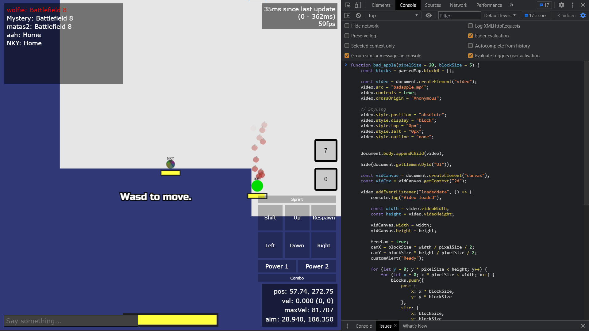
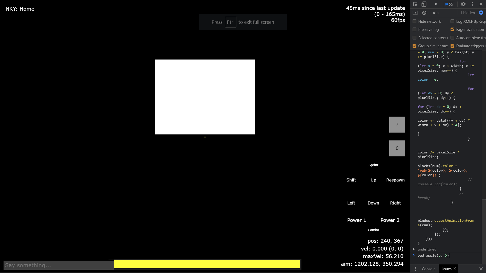
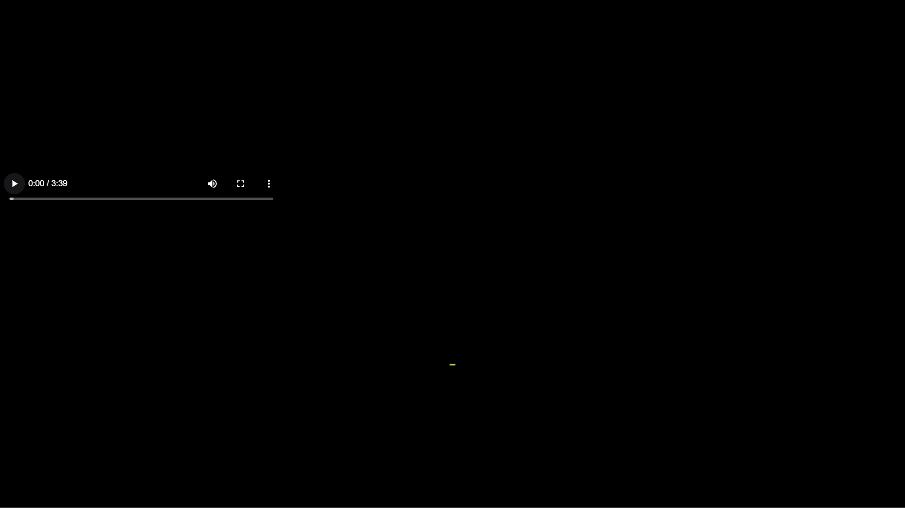
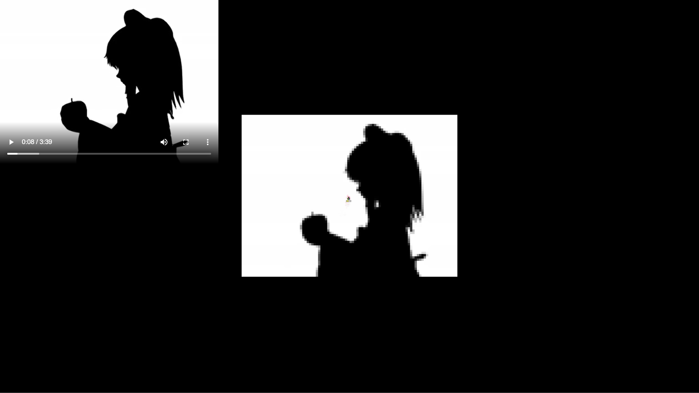

# How to Use This Script

Step 1.  
> Copy the script from any of the scripts:  
[`block.js`](block.js) uses `block0`s  
[`braille.js`](braille.js) uses `text`s with braille pixels (not aligned, idk why)
[`image.js`](image.js) uses `image0` and the video source (it's a joke)

Step 2.
> Open [SkapClient](https://nky5223.github.io/SkapClient).  
**Note that this script ONLY works on SkapClient, using it on normal skap.io would throw many errors.**

Step 3.
> Join a game

Step 4.
> Run the script in console, using `Ctrl+Shift+J`  

Step 5.
> If you used [`block.js`](block.js), run `bad_apple(`*`pixelSize`*`, `*`blockSize`*`)` where *`pixelSize`* is the sample size and *`blockSize`* is the size of the blocks.  
If you used [`braille.js`](braille.js), run `bad_apple(`*`x`*`, `*`y`*`)` where *`x`* and *`y`* is the position of the __**middle**__ of the video.  
If you used [`image.js`](image.js), run `bad_apple(`*`x`*`, `*`y`*`)` where *`x`* and *`y`* is the position of the __**top left**__ of the video.  

Step 6. 
> A video will appear and you will be freecammed to the video. Zoom out until the video fits in your screen, and play the video. Bad Apple will start playing in SkapClient.
 